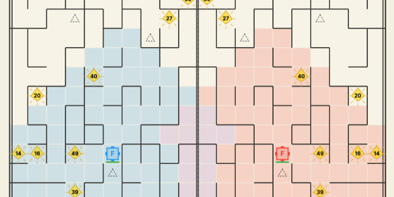

# Kaggle Maze Crawler

  
  
  
  

Notebook-first competition workspace for
[Kaggle Maze Crawler](https://www.kaggle.com/competitions/maze-crawler). The
repository documents the path from the official starter agent to stronger
jump-preferred BFS and worker wall-removal agents, with reproducible notebooks,
replay analysis, and versioned submission notes.

## 1. Executive Summary

Maze Crawler is a turn-based two-player maze game. Each agent controls a
factory and optional robots while the board scrolls upward from the south. The
main strategic problem is not simply collecting energy; it is keeping the
factory alive while using limited robot actions to gain map knowledge and avoid
dead ends.

This project improved the public score from a starter baseline of `217.0` to a
best observed worker-line peak around `1348` by moving from local greedy
movement to remembered-map pathfinding, jump-aware survival logic, and
conservative wall removal.

## 2. Results Snapshot

| Submission Line | Public Score | Notes |
| --- | ---: | --- |
| Starter-compatible baseline | `217.0` | official-starter style control notebook |
| Jump-BFS Version 2 | `1062.4` | first strong wall-memory + jump-BFS submission |
| Jump-BFS Version 6 | `1228.8` | best observed score; active scout replacement plus reset guard |
| Jump-BFS Version 8 | `1087.3` | danger gating underperformed the V6 scout behavior |
| Worker wall-removal Version 2 | peak around `1348` | strongest observed line; V6 core plus one conservative worker |
| Worker wall-removal Version 4 | `1035.8` | three-row-ahead worker target regressed, showing the worker can overextend |
| Worker wall-removal Version 6 | `1105.0` | two-row worker recovery improved over V4 but remained below V2 |

The latest public results show that worker wall removal can outperform the
jump-BFS line, but the Version 4 regression also shows that worker placement is
sensitive. Version 6 remains the jump-BFS reference, while the worker notebook
now tests a Version 7 candidate that keeps worker priority and adds one
high-reserve second scout for energy/tiebreak losses.

## 3. Agent Approach

| Component | Implementation |
| --- | --- |
| Factory pathing | jump-preferred BFS toward safer northern rows |
| Wall knowledge | persistent visible-wall cache with optimistic fog handling |
| Symmetry | mirrored wall inference across the board |
| Survival fallback | emergency jump, sidestep, and last-resort escape behavior |
| Scout policy | one active scout by default; worker notebook can add a second scout only when safe and wealthy |
| Jump-BFS reference | V6 active-scout replacement without danger gating |
| Worker experiment | one conservative worker opens known north walls ahead of the factory |
| Tested regression | V8 danger gating skipped scout builds near `southBound` and scored lower |
| Submission safety | per-episode memory reset and generated-file compilation checks |

## 4. Technical Skills Demonstrated

- Kaggle notebook engineering and submission packaging.
- Python agent design for turn-based game environments.
- Breadth-first search over dynamic known-map state.
- Persistent memory management under fog of war.
- Replay parsing and action-count diagnostics.
- Leaderboard-driven experiment tracking.
- Technical documentation for reproducible competition work.

## 5. Repository Structure

| Path | Purpose |
| --- | --- |
| [`notebooks/1_maze_crawler_starter.ipynb`](notebooks/1_maze_crawler_starter.ipynb) | clean starter-compatible control notebook |
| [`notebooks/2_maze_crawler_jump_bfs_agent.ipynb`](notebooks/2_maze_crawler_jump_bfs_agent.ipynb) | main experimental jump-BFS submission notebook |
| [`notebooks/3_maze_crawler_worker_wall_agent.ipynb`](notebooks/3_maze_crawler_worker_wall_agent.ipynb) | separate worker wall-removal experiment built on the V6 reference |
| [`docs/0_coding_standards.md`](docs/0_coding_standards.md) | project conventions |
| [`docs/1_instructions.md`](docs/1_instructions.md) | competition objective and solution framing |
| [`docs/2_eda_insights.md`](docs/2_eda_insights.md) | replay observations and visual references |
| [`docs/3_notebook_maze_crawler_kaggle_starter.md`](docs/3_notebook_maze_crawler_kaggle_starter.md) | starter notebook notes |
| [`docs/4_notebook_maze_crawler_jump_bfs_agent.md`](docs/4_notebook_maze_crawler_jump_bfs_agent.md) | jump-BFS algorithm notes |
| [`docs/5_agent_version_log.md`](docs/5_agent_version_log.md) | submission history, scores, and lessons |
| [`docs/6_notebook_maze_crawler_worker_wall_agent.md`](docs/6_notebook_maze_crawler_worker_wall_agent.md) | worker wall-removal experiment notes |

Generated `main.py` and `submission.py` are written inside Kaggle notebooks and
are intentionally ignored in git.

## 6. How To Run

1. Open the Kaggle competition and accept the rules.
2. Create or import a Kaggle notebook.
3. Upload or sync a notebook from `notebooks/`.
4. Run all cells.
5. Confirm the verification cell reports `main.py`, `submission.py`, and sync
   checks as `OK`.
6. Inspect the replay and optional batch-evaluation output.
7. Save a Kaggle version and submit from the notebook UI.

Use notebook 1 for a baseline sanity check. Use notebook 2 for the current
reference submission. Use notebook 3 only when testing the worker wall-removal
agent.

## 7. Current Lessons

- Factory tempo is the highest-value objective; energy is useful only if the
  factory survives the scroll.
- Active scout replacement can look wasteful on one seed but still improve
  leaderboard robustness through vision and wall discovery.
- Overfitting to a single notebook replay caused a regression, so each policy
  change now needs both replay inspection and broader episode evidence.
- The danger gate was too blunt: skipping scout builds near the scroll reduced
  the broader value of scouting more than it improved survival.
- Worker wall removal is the best observed direction so far, but it should
  remain a separate strategy line because small routing changes can swing
  results sharply.
- Some worker losses are not scroll deaths; they are energy/tiebreak losses
  where an opponent's extra scout collects more crystals. The current worker
  candidate tests a strict second-scout gate for that case.

## 8. Next Work

Use Version 6 as the jump-BFS control and Worker Version 2 as the strongest
observed strategy family. The next clean experiment is the Worker Version 7
candidate: keep the two-row worker route, preserve worker build priority, and
allow a second scout only when the factory has a large scroll gap and at least
`900` energy.
