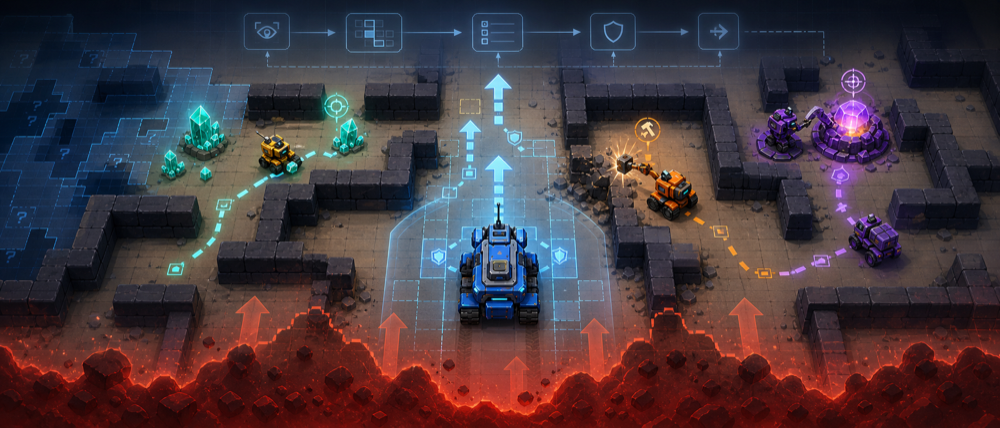
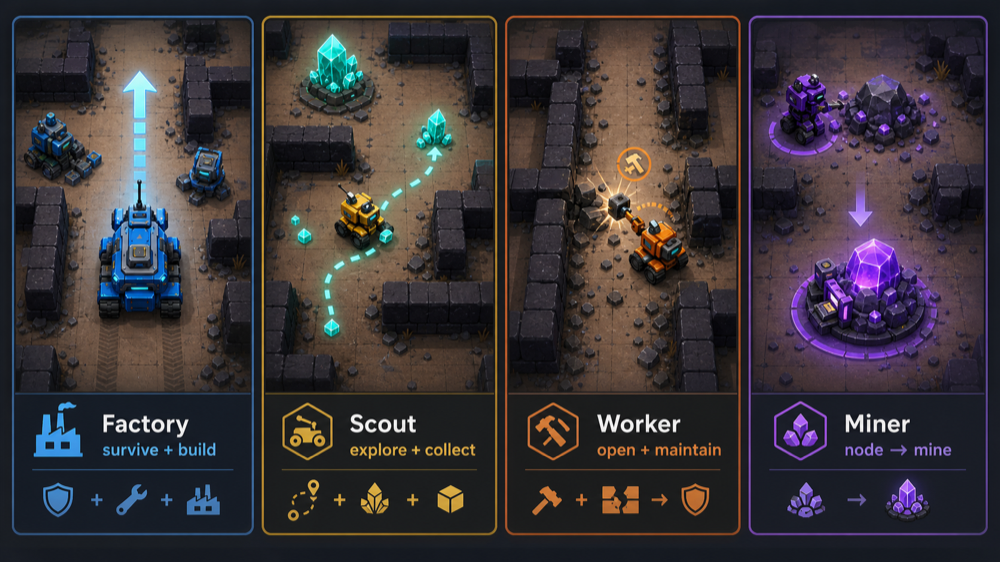
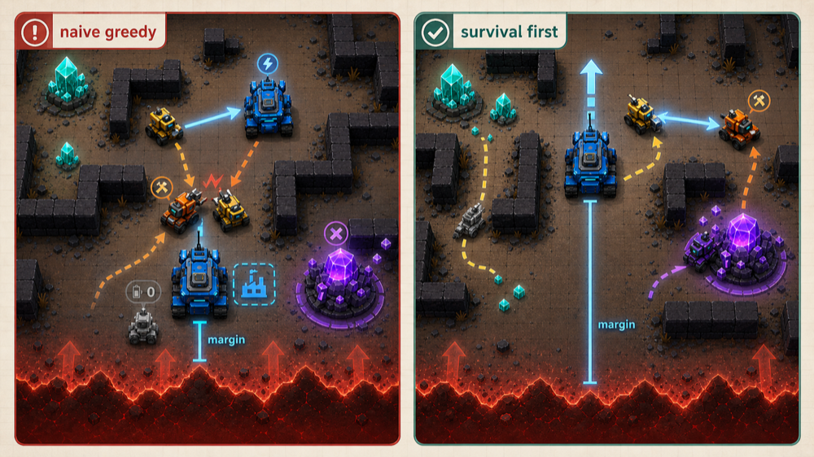
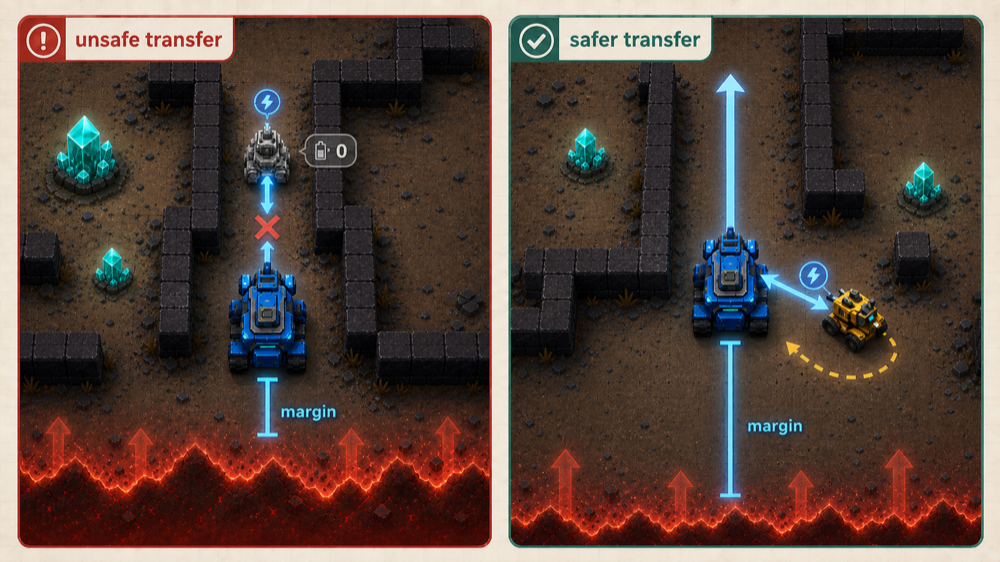
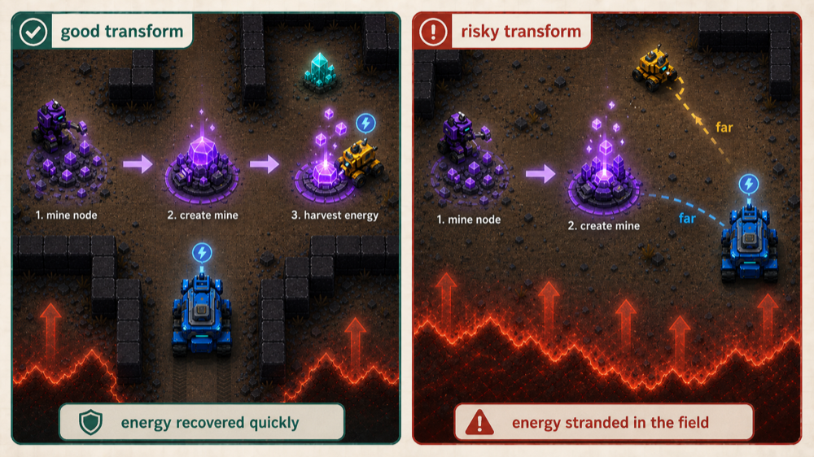
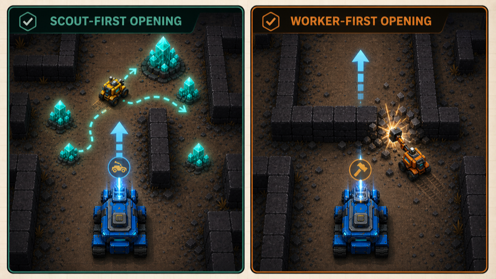
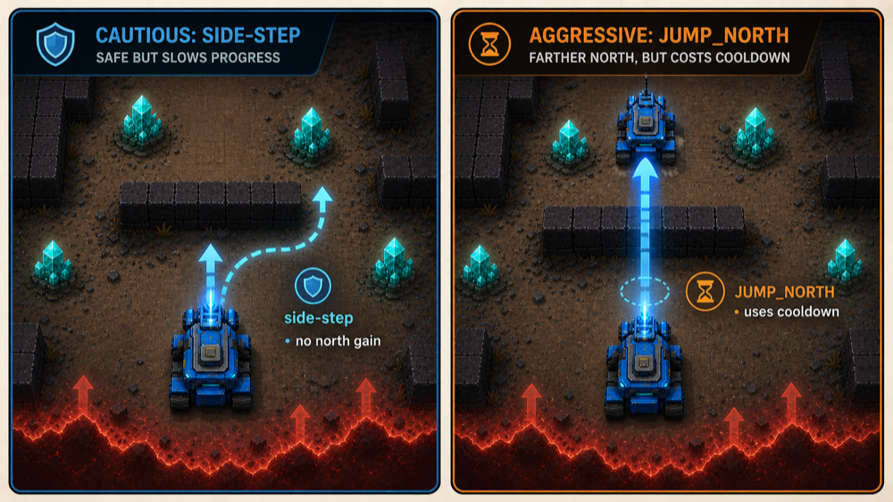

# 2. EDA Insights

## 1. What We Can Inspect

Maze Crawler is not a tabular prediction task. The useful EDA surface is the
environment observation and replay behavior:

- `obs.walls`: flat wall bitfield array.
- `obs.robots`: robot records keyed by uid.
- `obs.crystals`: visible crystal locations keyed as `col,row`.
- `obs.southBound`: current scrolling loss boundary.
- `config.width`: grid width used to index the wall array.

## 2. Visual Guide

The diagrams below are documentation copies from Pilkwang's public
Maze Crawler structure-baseline notebook and figure dataset. They are included
here because they explain the game constraints faster than text alone.

Source notebook:
https://www.kaggle.com/code/pilkwang/maze-crawler-structure-baseline

### 2.1 Game Overview

This overview is the mental model for the whole project: the factory is the
king piece, the board scrolls, and visible rewards matter only if the factory
keeps enough northward tempo.

### 2.2 Structure Map

The structure map frames this as a control problem rather than a prediction
problem. A good agent needs memory, pathing, safety checks, policy knobs, and a
final action emitter.

### 2.3 Greedy Versus Survival-First

The hard part is not finding energy. The hard part is turning energy into
usable robot energy without losing factory tempo, blocking the route, or
stranding value outside the robot economy.

### 2.4 Transfer Risk

Transfer is not just an accounting action. It changes which body has energy
and can leave the source robot as a low-energy blocker in a critical corridor.
This is why scout returns should be inspected in replay.

### 2.5 Transform As Investment

Mining is valuable only when stored mine energy can come back into robot
energy. A long-lived mine is not enough if carriers cannot safely retrieve and
bank the energy.

### 2.6 Opening Choice

There is no universal first build. Open starts can support scout-first crystal
search, while blocked or low-branching starts need worker-first wall control.

### 2.7 Jump Tradeoff

`JUMP_NORTH` is powerful but cooldown-limited. The starter uses it only when
north is blocked and the cooldown is ready; later policies should distinguish
emergency jumps from noncritical wall bypasses.

## 3. Wall Encoding

Known walls are encoded as direction bits:

| Direction | Bit |
| --- | ---: |
| `NORTH` | 1 |
| `EAST` | 2 |
| `SOUTH` | 4 |
| `WEST` | 8 |

The starter treats unknown wall cells as open. That is useful for a compact
baseline, but it is also a known weakness: a stronger policy should remember
walls and distinguish unknown from open.

## 4. Robot Records

The starter reads robot arrays as:

| Index | Meaning Used By Starter |
| ---: | --- |
| 0 | robot type |
| 1 | column |
| 2 | row |
| 3 | energy |
| 4 | owner/player |
| 6 | jump cooldown, when present |
| 7 | build cooldown, when present |

The current policy uses robot type `0` as factory and type `1` as scout.

## 5. Replay Insights

The screenshot and Kaggle replay renderer show why simulation is essential:

- The factory can win a random-opponent game by prioritizing northward tempo.
- The scroll boundary makes low-row hesitation dangerous.
- Crystals are visible rewards, but chasing them is secondary to factory
  survival.
- Transfers and scout returns should be inspected visually because a good
  energy action can still create a blocker.

## 6. Useful Notebook Outputs

The current notebook renders two replays:

1. `agent_v1` versus random.
2. `agent_v2` versus random.

The last committed Kaggle run on seed 42 produced:

| Agent | Player reward | Opponent reward | Read |
| --- | ---: | ---: | --- |
| `agent_v1` | 928 | -393 | factory-only north tempo survived well |
| `agent_v2` | -410 | 107 | adding the scout hurt this run |

The loss is useful: the scout can be net-negative when it blocks movement,
consumes a build opportunity, or follows a greedy route that does not protect
the factory. The jump-BFS notebook is meant to test whether stronger factory
pathing and less local scout movement fix that failure mode.

The latest jump-BFS notebook run survived with both policies:

| Agent | Player reward | Opponent reward | Read |
| --- | ---: | ---: | --- |
| `agent_v1` | 961 | -393 | factory pathing is healthy |
| `agent_v2` | 785 | -393 | scout still costs more than it returns |

Action extraction showed three `BUILD_SCOUT` actions and zero `TRANSFER_*`
actions. The next scout experiment should build only one scout, lower the
return threshold, and bank any positive energy when adjacent to the factory.
The public score also improved from `217` to `600`, so the survival pathing is
worth preserving while we tune economy.

Recommended manual notes after each run:

- final reward for each player;
- final status;
- step where the game ends;
- whether the factory used BFS or emergency jumps to escape low-row traps;
- whether the scout returned energy or died carrying it.

## 7. Suggested Future Charts

When we run paired-seed evaluations, add small charts here:

| Chart | Purpose |
| --- | --- |
| reward by seed | compare candidate policy to baseline |
| final step by seed | identify survival regressions |
| scout transfers by seed | measure whether crystal energy is banked |
| factory action counts | detect too much sidestepping, jumping, or idling |

If optional figure inputs are attached in Kaggle, the notebook can display the
full-size versions of these diagrams. The copies in `docs/assets/` are
downscaled documentation references for easier review in GitHub.
